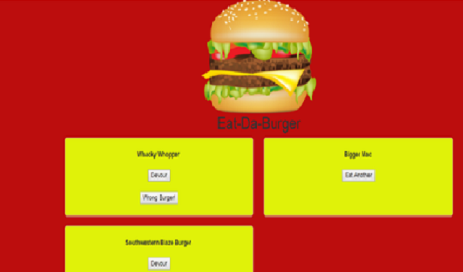
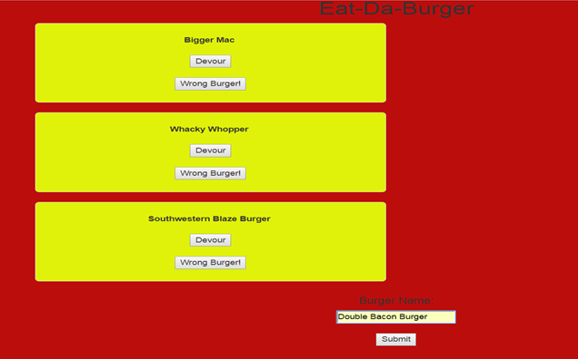

# eatDaBurgerz

An application which dynamically updates the DOM based on on click events that make changes to a MYSL Database.

## How it works!

1.) when the page first loads you will be able to view the wells of each item that is stored in the Database. These items will have 2 buttons: Devour, and Wrong Burger!.

2.) If a user clicks the Wrong Burger! Button it will process a PUT Request to delete the item from the database, and then redirect the route and when the page re-renders will remove the well element for that item.

3.) If a user clicks the Devour button it will update the devour value from true to false. This PUT request will process the update and when the page re-renders it will move this well to the Devour container on the page.

4.) Once an item has been changed to a devour value of true, the new well will be created on the right side of the screen. It will contain a button named Eat Another. This will process a PUT request to change the devour value to false, and move this well back to the left side of the DOM. 

5.) At the bottom of the page there is a form field to add a new burger. If a burger is entered and submitted this will process a POST request and add a new well with the burger that was added to the database.

# Technologies Used
* HTML
* CSS
* Bootstrap
* Javascript
* MYSQL
* Handlebars.js
* NPM
* Node
* Express
* Heroku
